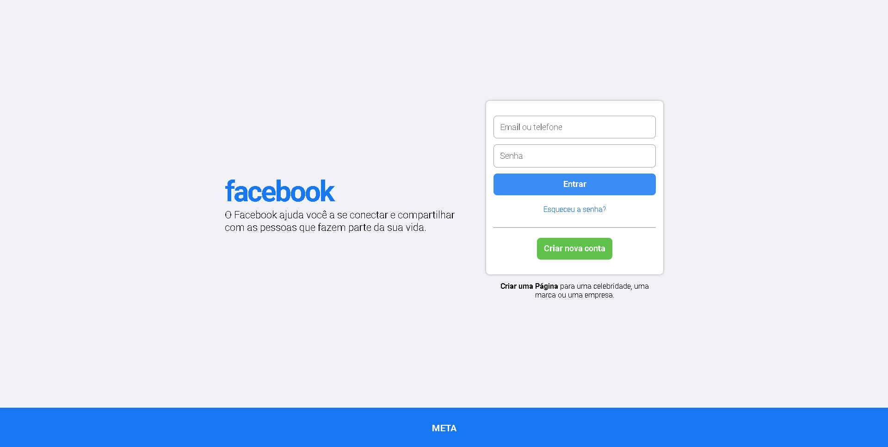

# Facebook Clone 🔥🏆

Desenvolvendo um clone da página inicial do Facebook com os métodos mais avançados com React, Vite, Typescript e Sass

## Layout 💻📱

## Code 👨‍💻

    yarn create vite facebook-clone --template react-ts
    |
    yarn

## Adicionando Biblioteca 📕

    yarna add sass

## Adicionando Fonte 🔠

    https://fonts.google.com/specimen/Roboto

## Adicionando as Cores 🎨

    $background: #f0f2f5;
    $blue: #1877f2;
    $green: #42b72a;
    $white: #fff;
    $grey: rgb(160, 160, 160);